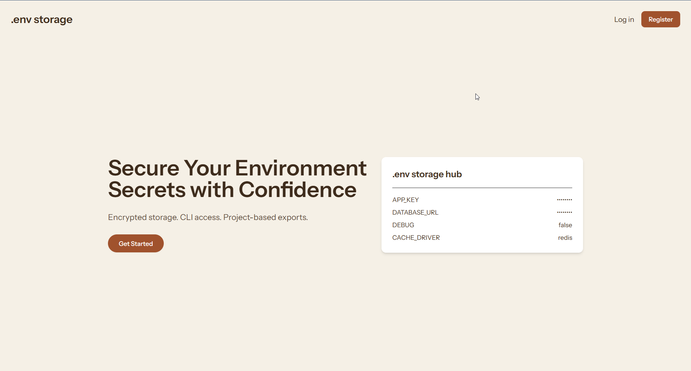
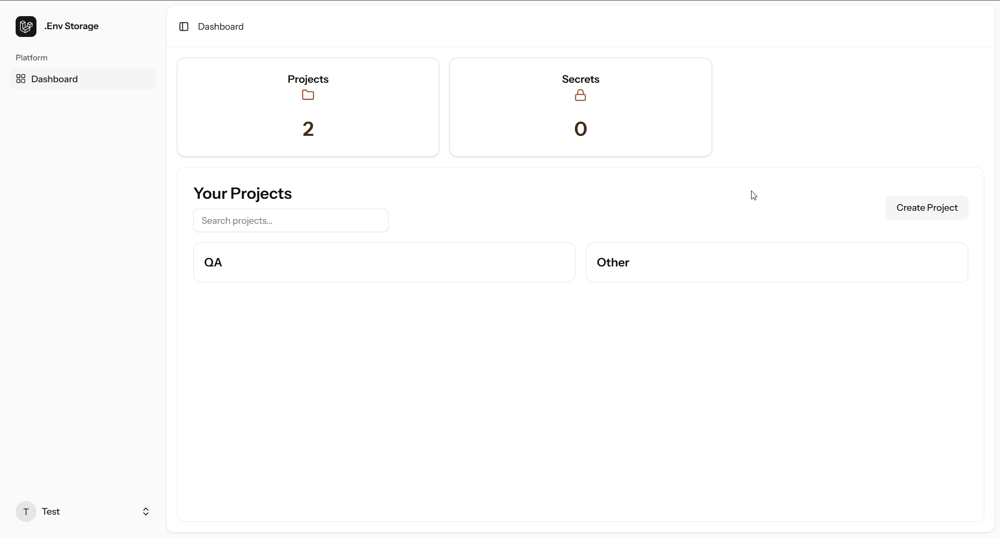
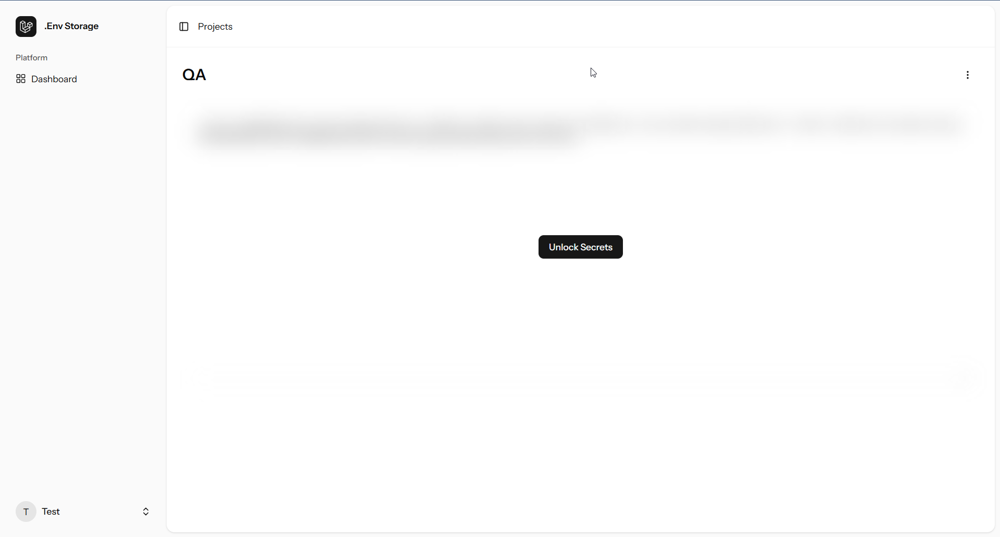

# 🔐 Env Storage

**Env Storage** is a secure and developer-friendly web app designed for managing environment variables by project. It allows users to encrypt, store, and manage secrets with full client-side protection and a seamless user experience — all in a clean, mobile-responsive UI.

🌐 [Live](https://env-storage.onrender.com/)

---

## 📸 Screenshot

---

## 🧩 Key Features

- 🔐 End-to-end encrypted secret storage
- 🧰 Project-based environment management
- 🗝 User-defined project key for decryption
- 🌙 Secrets are blurred by default and unlockable
- 📱 Mobile responsive and intuitive interface
- ⚡ Fast and modern tech stack

---

## 🛠 Tech Stack

- **Based On**: Laravel 12
- **Frontend**: React, Tailwind CSS, Shadcn UI  
- **Backend**: PostgreSQL (via Supabase or custom API), migration from sql database to postgres  
- **Security**: No key stored.
- **Node.js / Vite** – Fast local development

---

## 📄 Source Code

The source code is private and not publicly available at this time.

---

## 🙏 Thank You

Thank you for checking out **Env Storage**!  
If you liked the project, consider sharing the [Live at](https://env-storage.onrender.com/) or dropping a ⭐️ if it becomes open source in the future.
